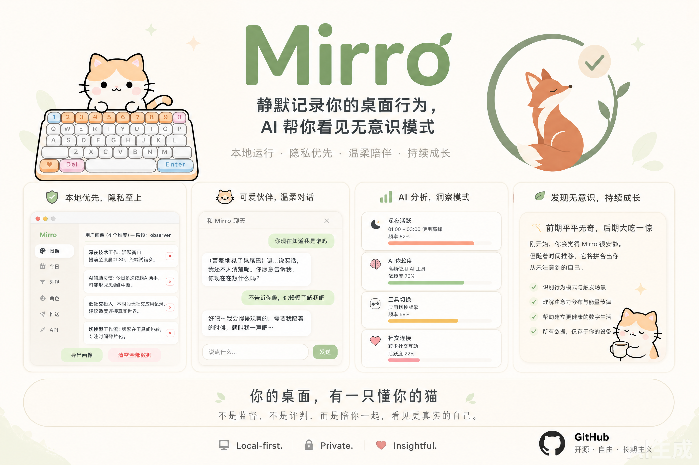

# Mirro



本地桌面自我认知工具。通过静默记录电脑使用行为，AI 分析帮助用户发现无意识的行为模式。一只桌面小猫 Mirro 以陪伴的方式传递洞察。

## 它做什么

- **静默采集**：记录前台窗口活动、输入统计、浏览域名（本地存储，经 PII 脱敏）
- **每日角色卡**：AI 分析当日行为，生成行为素描、新发现、阶段反馈
- **生长的画像**：用户画像持续积累，AI 自主定义维度（作息、工具偏好、注意力分布等）
- **陪伴聊天**：跟 Mirro 对话，它基于画像和行为洞察给出有依据的反馈，随了解深入越来越聪明
- **三轮关系**：observer → familiar → intimate，语气从陈述到建议随关系推进

## 技术栈

| 层 | 技术 |
|----|------|
| 框架 | Electron 37 |
| 前端 | React 19 + Vite 7 + TypeScript |
| 数据库 | better-sqlite3（本地 SQLite） |
| 输入监听 | uiohook-napi（全局键盘钩子） |
| 窗口监听 | active-win（前台窗口检测） |
| AI | 用户自备 LLM API Key，支持 OpenAI / Anthropic / Google / DeepSeek / Moonshot / Zhipu / Ollama |
| 定时任务 | node-cron |

## 为什么是桌面应用

Mirro 依赖操作系统级别的 API，无法作为 Web 应用运行：
- 全局键盘钩子（记录输入统计、触发动画）
- 前台窗口检测（识别当前使用的应用和网站）
- 系统托盘（后台常驻）
- 无边框透明窗口（桌面宠物）
- 本地文件系统（数据库、聊天记录、记忆）

## 环境要求

- **macOS**（Apple Silicon 或 Intel）
- **Node.js** ≥ 18
- **npm** ≥ 9
- **LLM API Key**（OpenAI / Anthropic / Google / DeepSeek / Moonshot / Zhipu / Ollama 任选一个）

## 启动

```bash
# 安装依赖
npm install

# 开发模式（前端热重载 + Electron）
npm run dev:electron
```

首次启动后：
1. 点击宠物 → 设置齿轮 → API Tab
2. 选择 LLM 供应商，填入 API Key，点击测试连接
3. 回到「今日」Tab，点击"立即生成"测试 AI 分析

## 构建

```bash
npm run build
```

## 项目结构

```
├── electron/
│   ├── main.ts            # 主进程：窗口管理、IPC、采集、定时任务
│   ├── preload.ts/cjs     # 预加载脚本（IPC 桥接）
│   ├── store.ts           # SQLite 数据层
│   ├── llm.ts             # LLM 调用封装（7 个供应商）
│   ├── scheduler.ts       # 夜间生成管道（3-Agent）
│   ├── collector.ts       # 行为采集状态管理
│   ├── sanitizer.ts       # PII 脱敏引擎
│   ├── keystroke.ts       # 按键码→字符映射
│   ├── memory.ts          # 记忆系统 + 聊天持久化
│   └── agents/
│       ├── interpreter.ts  # Agent 1：文本解析（拼音还原）
│       ├── analyst.ts      # Agent 2：行为分析师
│       └── portrait-manager.ts  # Agent 3：画像管理器
├── src/
│   ├── App.tsx            # 路由（hash：widget/card/chat/settings）
│   ├── components/
│   │   ├── Widget.tsx     # 桌面宠物
│   │   ├── ChatWindow.tsx # 聊天窗口
│   │   ├── CardWindow.tsx # 卡片窗口
│   │   └── Settings.tsx   # 设置面板（6 Tab）
│   ├── hooks/
│   │   └── useSettings.ts # 设置 hook
│   └── assets/            # APNG 动画 + 图标
├── shared/
│   └── types.ts           # 共享类型定义
└── docs/                  # PRD、架构文档
```

## 架构亮点

**3-Agent 夜间管道：**
1. **Text Interpreter** — 本地脱敏后还原拼音、解析文本内容
2. **Behavior Analyst** — 分析行为模式，生成角色卡
3. **Portrait Manager** — 评估画像更新，建议阶段推进/回退

**洞察回流机制：**
```
夜间分析 → 行为洞察写入记忆系统 → 聊天 prompt 注入 → Mirro 越来越了解你
```

**数据隐私：** 全量数据本地存储，发送前经本地规则引擎脱敏（API key、密码、路径、base64 全部过滤），只有脱敏后的结构化摘要发给 LLM。

## 数据存储

```
~/Documents/Mirro/
  mirro.db          # SQLite 数据库
  memories/         # 长期记忆（≤30KB，自动清理）
  chats/            # 当天聊天（夜间清空）
  nudges.json       # 个性化轻推消息
```

## License

All rights reserved.
